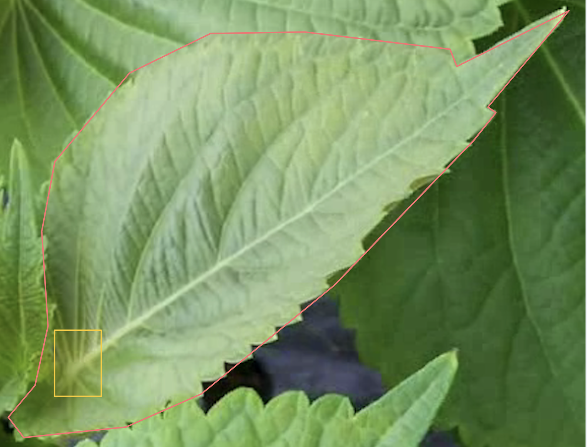

# Leaf Area (hypothesis)

여러 곳에서 수확한 4~5장으로 보았을 때 비율이 비슷함

특히 위아래와 양옆 비율이 1:1인 경우가 많았음

빨간색 선을 알아낸다면 초록색 선은 대략 1/2해서 사용해도 될 듯

다만 a를 사용자 임의로 찾아야 하는데...

윗 부분에 조금 남겨두면서 교차점 생기게...

빨간색 선 구하기...

잎 segmentation 결과를 배경지워서 깔끔하게 가져옴

밑의 중심을 bbox로 알아낼 건데, 이건 얼마 걸리지 않을 것 같아서 우리끼리 annotation 추가하면 될 것 같음

밑의 중심이 bbox의 중심점이 되도록 그리는 것

그럼 그 중심점으로부터 잎의 모든 polygon 점들과의 거리를 계산하여 가장 길이가 긴 직선을 찾음

### 한계점

(중심이 작은 잎에 가려진 경우..)

(낮이 되어도 다 피지 못한 잎...)

(+) 그래도 이 경우에는 옆으로 가장 긴 경우를 잡아낸다면 승산있는데ㅠ 각 점에 대해서 일일이 연결 n^2번 해도 되는 걸까?

(사선에서 찍힌 경우

정확히 옆면이 아니라면

상대적으로 빨간선이 작게 측정될 수 있음)

+) 사실 밑의 줄기부분만 가리고

나머지 부분은 잘 보이는 잎의 경우는 위쪽 꼭대기를 기준으로 그을 수 있고...

.
